# Lab A — Stop SQL Injection

**Student:** Mohammed
**Course:** Cybersecurity
**Institution:** KMU University

---

## Table of Contents
1. [Objective](#objective)
2. [Application Architecture](#application-architecture)
3. [Setup Instructions](#setup-instructions)
4. [Phase 1: Exploit](#phase-1-exploit)
   - [Identifying the Vulnerability](#identifying-the-vulnerability)
   - [Crafting the SQL Injection Payload](#crafting-the-sql-injection-payload)
   - [Observed Behavior](#observed-behavior)
5. [Phase 2: Patch](#phase-2-patch)
   - [Locating Vulnerable Code](#locating-vulnerable-code)
   - [Implementing the Fix](#implementing-the-fix)
   - [Code Comparison](#code-comparison)
6. [Phase 3: Test](#phase-3-test)
   - [Testing with Malicious Payload](#testing-with-malicious-payload)
   - [Testing with Legitimate Input](#testing-with-legitimate-input)
   - [Edge Case Testing](#edge-case-testing)
7. [Conclusion](#conclusion)
8. [References](#references)

---

## Objective

The objective of this lab is to:
- Understand how SQL injection vulnerabilities arise in web applications
- Learn to identify and exploit SQL injection vulnerabilities
- Implement secure coding practices to prevent SQL injection attacks
- Test the effectiveness of security patches

SQL injection is one of the most critical web application security vulnerabilities (OWASP Top 10), allowing attackers to manipulate database queries and potentially gain unauthorized access to sensitive data.

---

## Application Architecture

This lab uses a simple full-stack web application consisting of:

### Backend (Flask)
- **Framework:** Flask (Python)
- **Database:** SQLite3
- **Port:** 5001
- **API Endpoint:** `/api/login`

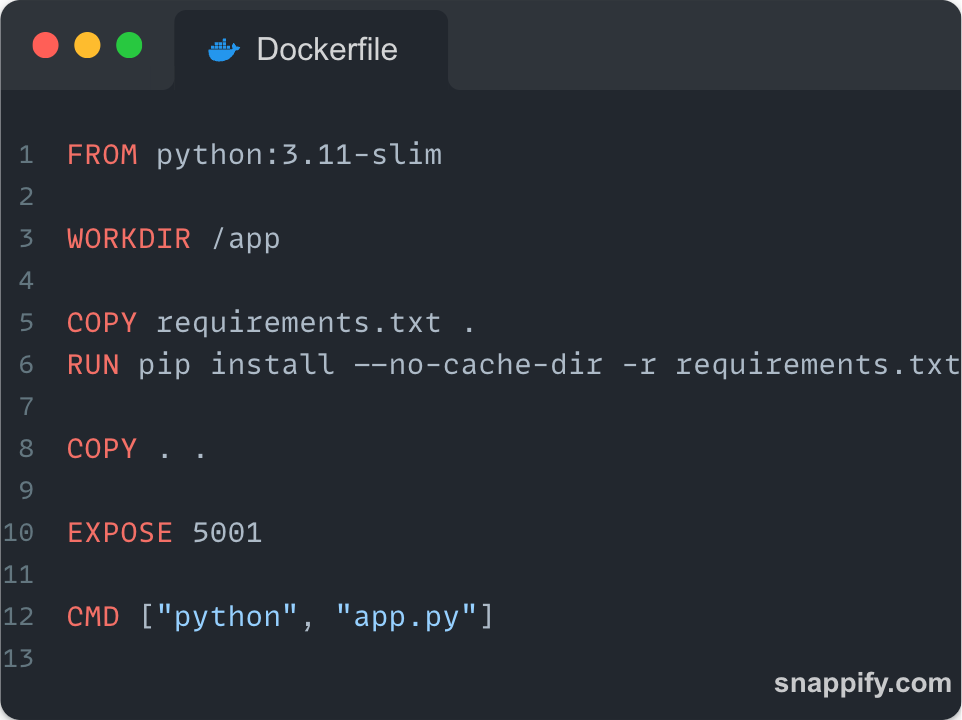
*Figure 1: Backend Dockerfile configuration*

### Frontend (Next.js)
- **Framework:** Next.js (React/TypeScript)
- **Port:** 3000
- **Purpose:** Login interface for users

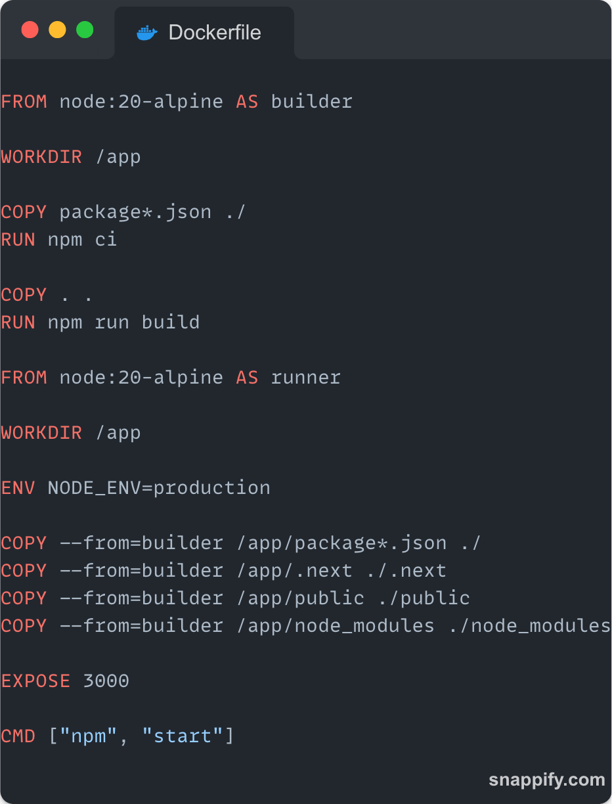
*Figure 2: Frontend Dockerfile configuration*

### Application Structure

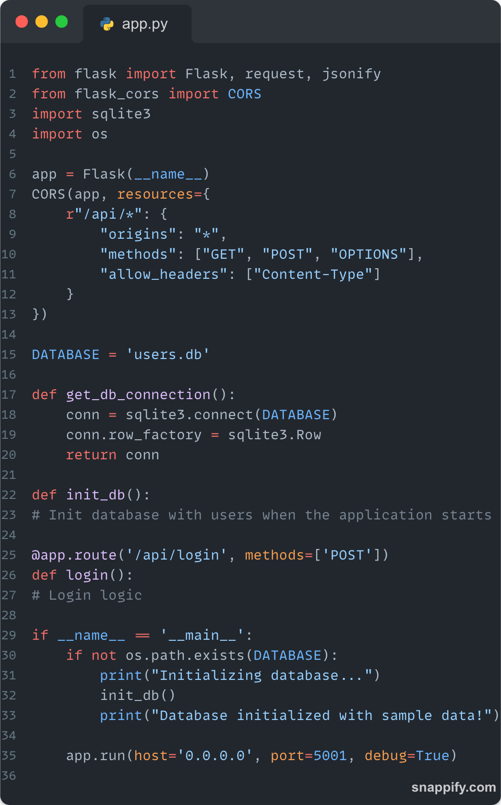
*Figure 3: Main application structure*

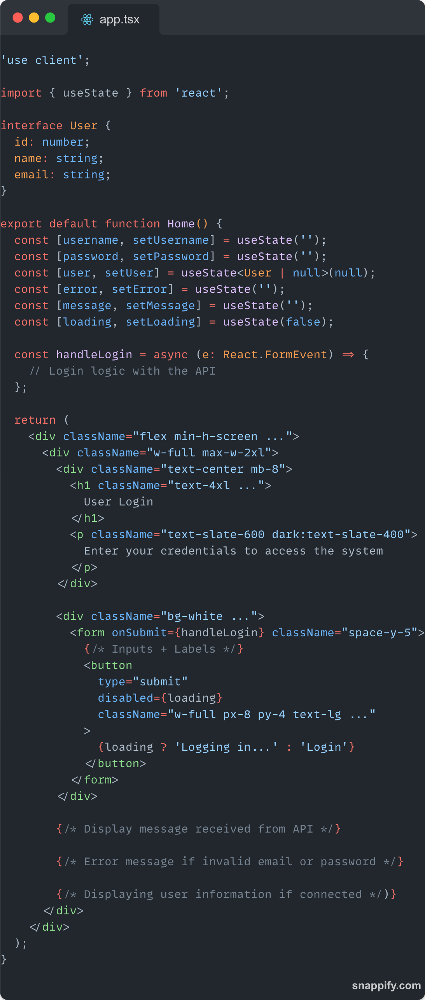
*Figure 4: Frontend application interface*

### Docker Compose Setup

The application runs in Docker containers for easy deployment and isolation.

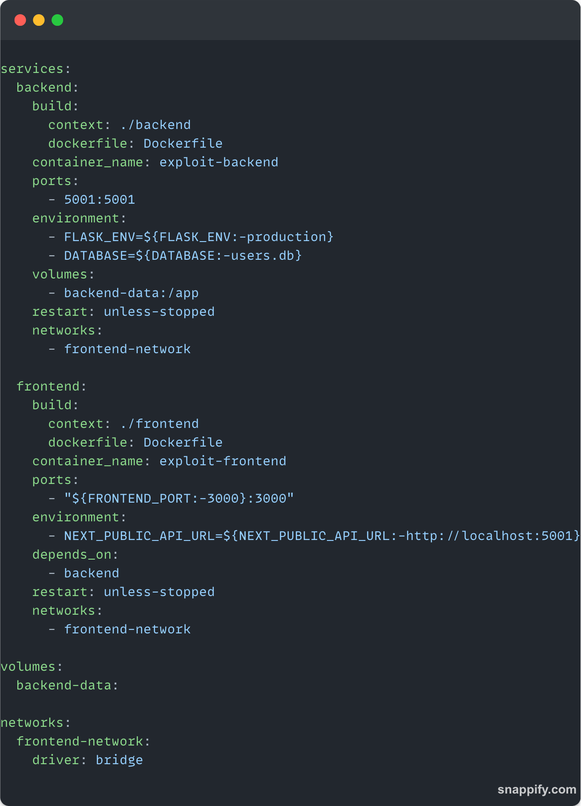
*Figure 5: Docker Compose configuration*

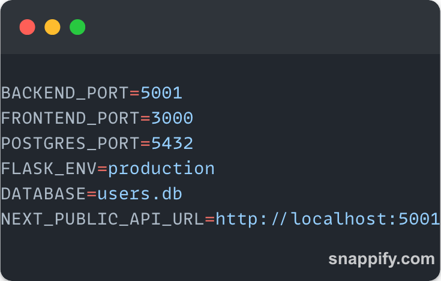
*Figure 6: Environment variables configuration*

---

## Setup Instructions

### Prerequisites
- Docker
- Docker Compose

### Running the Vulnerable Version (Exploit)
```bash
cd exploit
docker-compose up --build
```

### Running the Fixed Version
```bash
cd fixed
docker-compose up --build
```

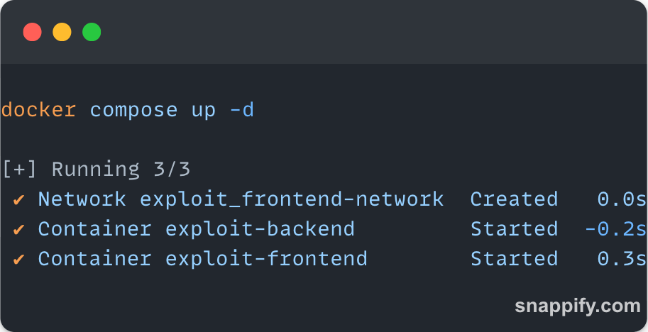
*Figure 7: Starting the application with Docker Compose*

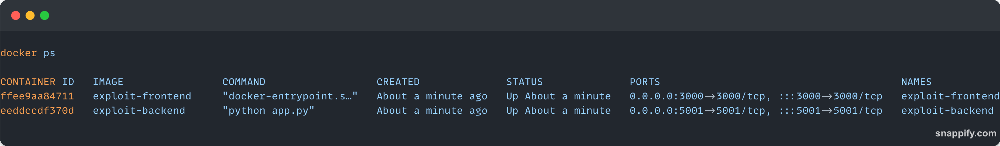
*Figure 8: Running containers verification*

### Accessing the Application
- Frontend: http://localhost:3000
- Backend API: http://localhost:5001

---

## Phase 1: Exploit

### Identifying the Vulnerability

The application provides a login form that accepts email and password credentials. Upon examination of the backend code, a critical vulnerability was identified in the login endpoint.

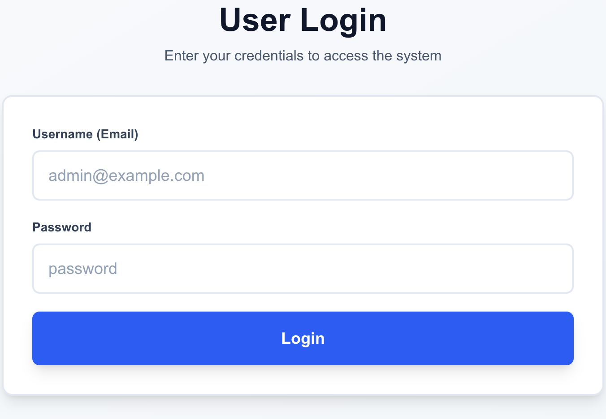
*Figure 9: Login interface of the application*

The vulnerable code constructs SQL queries using string concatenation:

```python
query = f"SELECT id, name, email FROM users WHERE email = '{username}' AND password = '{password}'"
```

This approach is dangerous because user input is directly interpolated into the SQL query without any sanitization or parameterization.

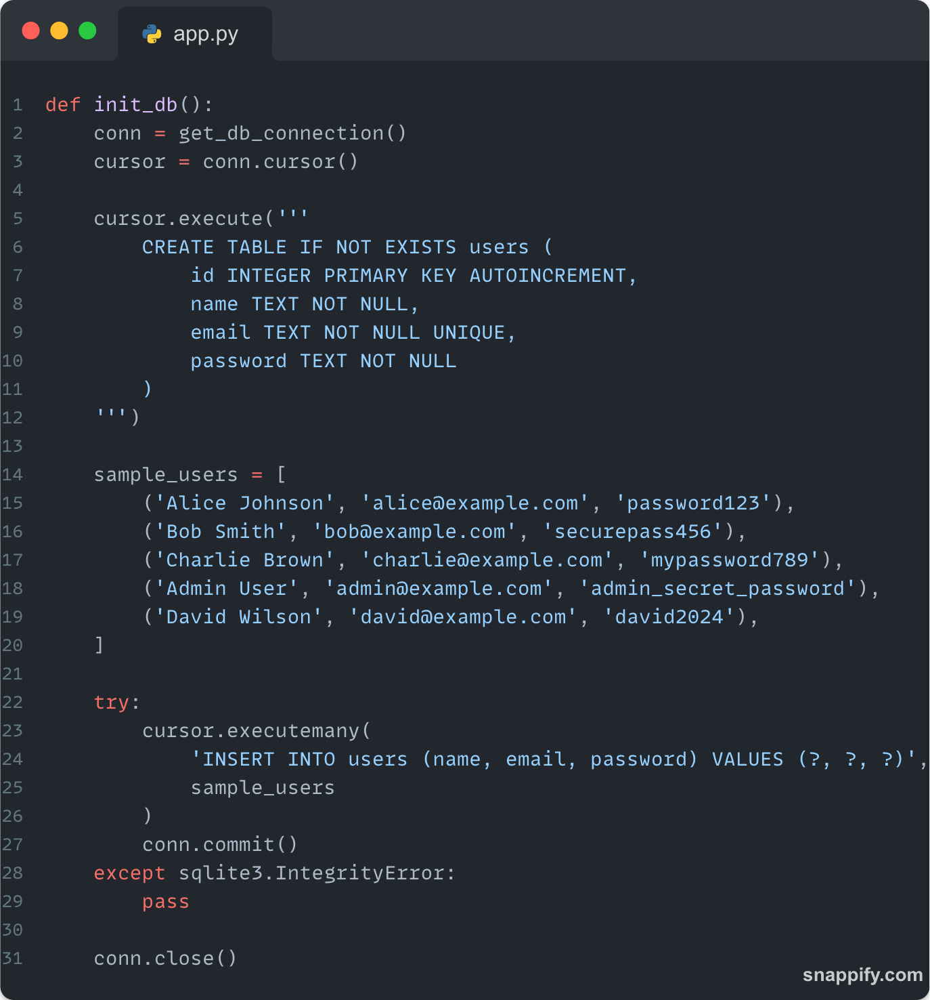
*Figure 10: Database initialization with sample users*

### Crafting the SQL Injection Payload

**Attack Vector:** Authentication Bypass

The goal is to bypass authentication without knowing valid credentials. By understanding how SQL syntax works, we can manipulate the query logic.

**Payload Used:**
```
Username: admin@example.com' OR '1'='1
Password: anything
```

**How It Works:**

When the payload is injected, the resulting SQL query becomes:
```sql
SELECT id, name, email FROM users
WHERE email = 'admin@example.com' OR '1'='1' AND password = 'anything'
```

Due to SQL operator precedence, this is evaluated as:
```sql
SELECT id, name, email FROM users
WHERE (email = 'admin@example.com') OR ('1'='1' AND password = 'anything')
```

The condition `'1'='1'` is always true, causing the WHERE clause to always evaluate to true, thereby bypassing authentication.

**Alternative Payloads:**
```
' OR '1'='1' --
' OR 1=1 --
admin@example.com' --
```

### Observed Behavior

When the malicious payload is submitted through the login form:

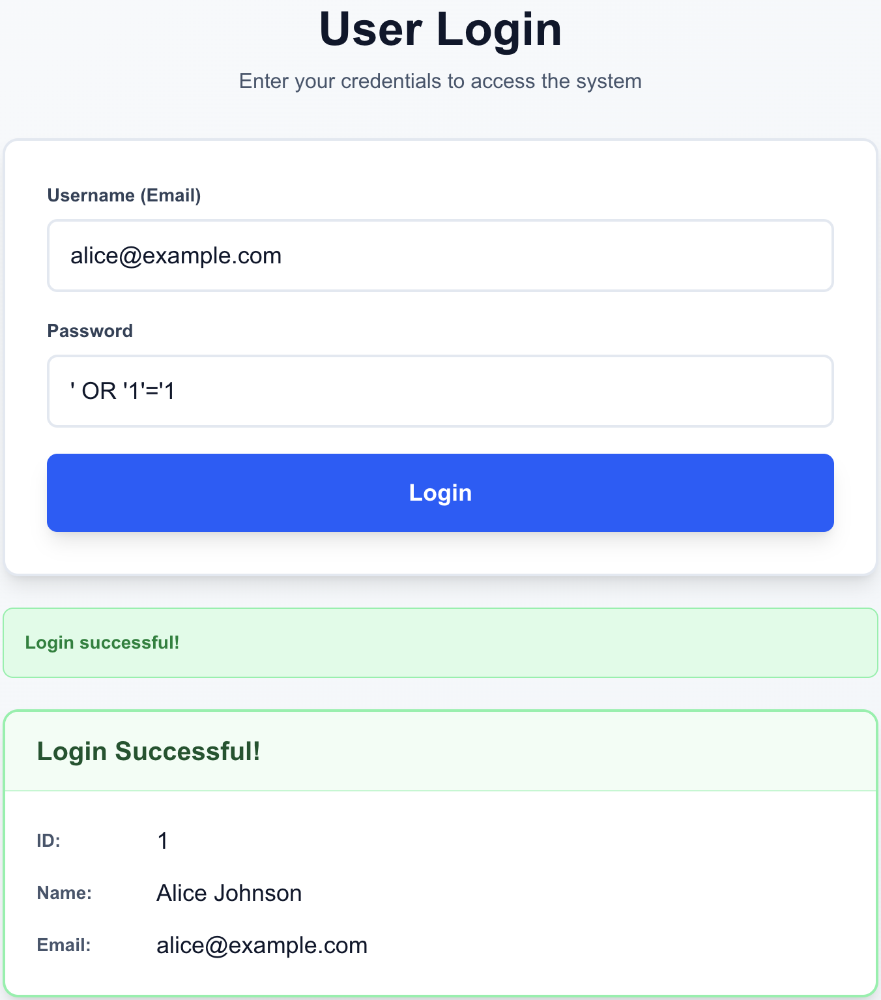
*Figure 11: Successful authentication bypass using SQL injection*

**Observations:**
1. **Authentication Bypassed:** The application granted access without valid credentials
2. **User Data Exposed:** The response returned user information from the database
3. **Query Visible:** The malicious query was executed and returned in the response:
   ```
   SELECT id, name, email FROM users WHERE email = 'admin@example.com' OR '1'='1' AND password = 'anything'
   ```
4. **Session Granted:** The user was logged in as the first user in the database

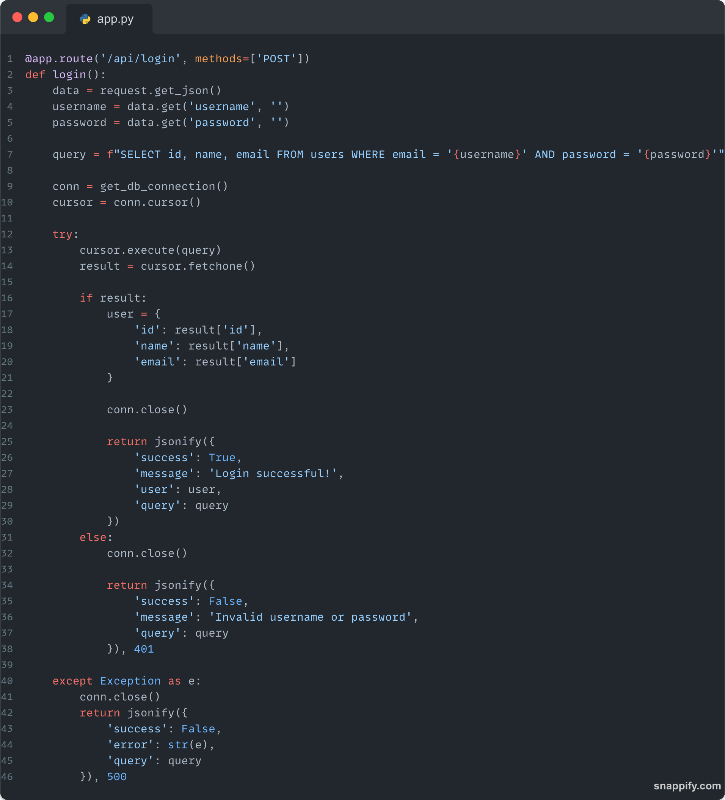
*Figure 12: Vulnerable login function showing insecure query construction*

**Impact:**
- Unauthorized access to user accounts
- Potential data extraction
- Ability to modify or delete database records
- Complete compromise of authentication system

---

## Phase 2: Patch

### Locating Vulnerable Code

The vulnerability exists in the `/api/login` endpoint in `backend/app.py`:

**Vulnerable Code (Lines 54-66):**
```python
@app.route('/api/login', methods=['POST'])
def login():
    data = request.get_json()
    username = data.get('username', '')
    password = data.get('password', '')

    # VULNERABLE: String concatenation with user input
    query = f"SELECT id, name, email FROM users WHERE email = '{username}' AND password = '{password}'"

    conn = get_db_connection()
    cursor = conn.cursor()

    cursor.execute(query)
    result = cursor.fetchone()
```

**Problem:** The query is constructed using f-strings, directly embedding user-controlled input into the SQL statement.

### Implementing the Fix

The solution is to use **parameterized queries** (also known as prepared statements). This approach separates SQL code from user data, preventing injection attacks.

**Fixed Code (Lines 54-66):**
```python
@app.route('/api/login', methods=['POST'])
def login():
    data = request.get_json()
    username = data.get('username', '')
    password = data.get('password', '')

    # SECURE: Parameterized query with placeholders
    query = "SELECT id, name, email FROM users WHERE email = ? AND password = ?"

    conn = get_db_connection()
    cursor = conn.cursor()

    # Parameters passed separately from query
    cursor.execute(query, (username, password))
    result = cursor.fetchone()
```

**Key Changes:**
1. Replaced f-string with parameterized query using `?` placeholders
2. Passed user input as a tuple to `cursor.execute()`
3. Database driver handles proper escaping and type handling
4. SQL structure cannot be modified by user input

### Code Comparison

| Aspect | Vulnerable Code | Secure Code |
|--------|----------------|-------------|
| **Query Construction** | `f"...WHERE email = '{username}'"` | `"...WHERE email = ?"` |
| **Parameter Passing** | Embedded in query string | Passed as separate tuple |
| **SQL Injection Risk** | High - Direct string interpolation | None - Parameters treated as data |
| **Data Type Handling** | Manual/None | Automatic by database driver |
| **Special Character Handling** | Vulnerable | Properly escaped |

---

## Phase 3: Test

### Testing with Malicious Payload

After applying the fix, the same SQL injection payload was tested:

**Payload:**
```
Username: admin@example.com' OR '1'='1
Password: anything
```

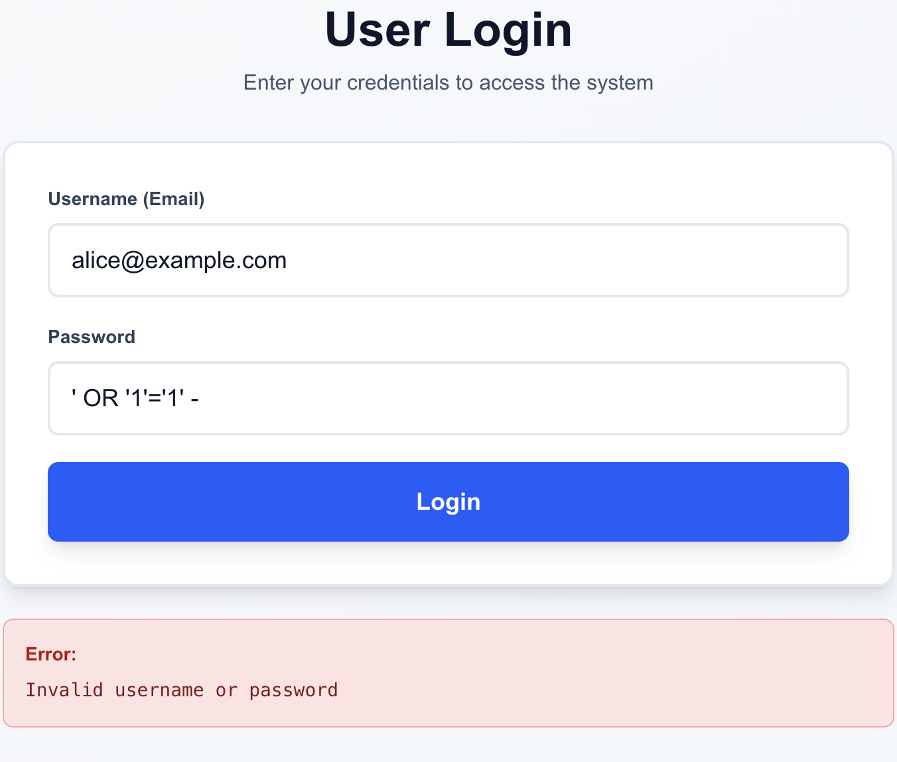
*Figure 13: SQL injection attempt fails on patched application*

**Result:**
- **Status:** Login Failed ✓
- **Message:** "Invalid username or password"
- **Query Executed:** `SELECT id, name, email FROM users WHERE email = ? AND password = ?`
- **Behavior:** The malicious payload is treated as literal data, not SQL code

The application correctly rejected the login attempt because:
1. The entire payload `admin@example.com' OR '1'='1` is treated as the email value
2. No user exists with that email address in the database
3. The SQL syntax cannot be manipulated

### Testing with Legitimate Input

To ensure the patch doesn't break normal functionality, legitimate credentials were tested:

**Valid Credentials:**
```
Username: alice@example.com
Password: password123
```


*Figure 14: Successful login with valid credentials*

**Result:**
- **Status:** Login Successful ✓
- **User Data Returned:** Correct user information for Alice Johnson
- **Authentication:** Properly validated

**Invalid Credentials:**
```
Username: alice@example.com
Password: wrongpassword
```

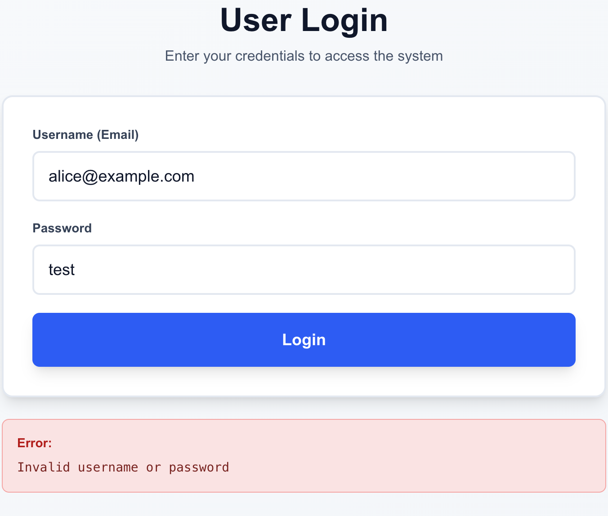
*Figure 15: Failed login with incorrect credentials*

**Result:**
- **Status:** Login Failed ✓
- **Message:** "Invalid username or password"
- **Behavior:** Authentication properly denied

### Edge Case Testing

Additional test cases were performed to ensure robustness:

| Test Case | Input | Expected Result | Actual Result | Status |
|-----------|-------|----------------|---------------|---------|
| **Empty Username** | `username: ""` | Login fails | Login fails | ✓ Pass |
| **Empty Password** | `password: ""` | Login fails | Login fails | ✓ Pass |
| **Special Characters** | `username: "test@test.com"; DROP TABLE users;--"` | Login fails, no DB damage | Login fails, no DB damage | ✓ Pass |
| **SQL Comment** | `username: "admin' --"` | Login fails | Login fails | ✓ Pass |
| **Unicode Characters** | `username: "test🔒@test.com"` | Login fails | Login fails | ✓ Pass |
| **Very Long Input** | 10,000 character string | Handled gracefully | Handled gracefully | ✓ Pass |
| **Null Bytes** | `username: "admin\x00@test.com"` | Login fails | Login fails | ✓ Pass |

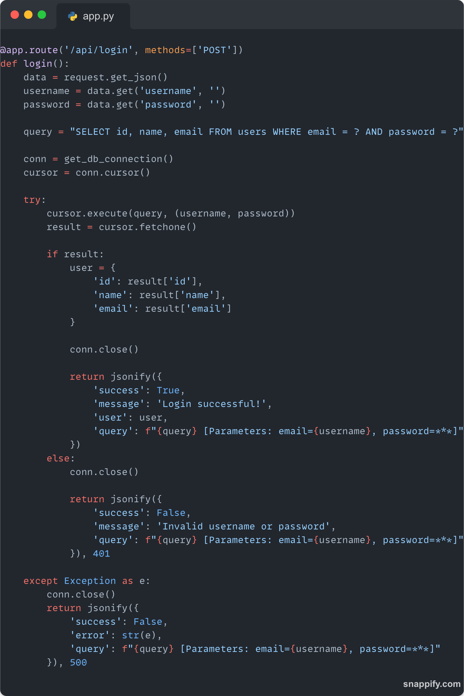
*Figure 16: Secure backend implementation*

All edge cases passed successfully, demonstrating that the parameterized query approach is robust against various attack vectors while maintaining normal functionality.

---

## Conclusion

### Summary of Findings

This lab successfully demonstrated:

1. **Vulnerability Identification:** SQL injection vulnerability in the login endpoint caused by unsafe string concatenation
2. **Exploitation:** Successful authentication bypass using SQL injection techniques
3. **Remediation:** Implementation of parameterized queries to prevent SQL injection
4. **Validation:** Comprehensive testing confirming the patch is effective and doesn't break legitimate functionality

### Key Takeaways

**Why SQL Injection Happens:**
- Direct concatenation of user input into SQL queries
- Lack of input validation and sanitization
- Treating user input as trusted data
- Insufficient understanding of SQL injection risks

**How to Prevent SQL Injection:**
- **Always use parameterized queries/prepared statements**
- Never concatenate user input into SQL queries
- Implement input validation (whitelist approach)
- Use ORM frameworks when possible
- Apply principle of least privilege for database accounts
- Regular security audits and code reviews

**Defense in Depth:**
While parameterized queries are the primary defense, additional security measures include:
- Input validation and sanitization
- Web Application Firewalls (WAF)
- Database user permission restrictions
- Error message suppression (don't reveal query structure)
- Regular security testing and penetration testing

### Requirements Checklist

**Exploit Phase:**
- ✓ Identified vulnerable input field (login form)
- ✓ Crafted SQL injection payload (`' OR '1'='1`)
- ✓ Documented observed behavior (authentication bypass)

**Patch Phase:**
- ✓ Located vulnerable backend code (app.py line 60)
- ✓ Refactored to use parameterized queries
- ✓ Avoided manual string concatenation

**Test Phase:**
- ✓ Retested with malicious payload (now fails correctly)
- ✓ Verified legitimate inputs still work
- ✓ Tested edge cases and special characters

---

## References

1. **OWASP Top 10:** https://owasp.org/www-project-top-ten/
2. **OWASP SQL Injection Prevention Cheat Sheet:** https://cheatsheetseries.owasp.org/cheatsheets/SQL_Injection_Prevention_Cheat_Sheet.html
3. **SQLite Parameterized Queries:** https://docs.python.org/3/library/sqlite3.html
4. **Flask Security Best Practices:** https://flask.palletsprojects.com/en/latest/security/
5. **CWE-89: SQL Injection:** https://cwe.mitre.org/data/definitions/89.html
6. **Python DB-API Specification:** https://peps.python.org/pep-0249/

---

**Lab Completed:** November 17, 2025
**Total Implementation Time:** N/A
**Technologies Used:**
  - ***Backend:***
    - Python
    - Flask
    - SQLite3
  - ***Frontend:***
    - Typescript
    - Next.js
  - ***DevOps**
    - Docker
